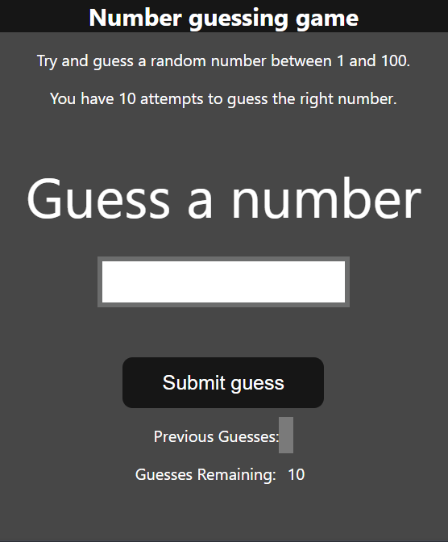

```markdown
# 🎯 Number Guessing Game 🎲

## 📜 Description
A fun and interactive **Number Guessing Game** built using **HTML, CSS, and JavaScript**! The player has 10 attempts to guess a randomly generated number between 1 and 100. The game provides feedback on whether the guess is too high or too low and tracks previous guesses.

## ✨ Features
✅ Random number generation 🎲
✅ User input validation 🧐
✅ Feedback on guesses 📊
✅ Score tracking 🏆
✅ Restart game functionality 🔄
✅ Responsive and interactive UI 🎨

## 💻 Technologies Used
🚀 **HTML** - Structure of the game
🎨 **CSS** - Styling for the user interface
⚡ **JavaScript** - Handles game logic & interactions

## 📦 Installation & Usage
```sh
# Clone this repository 🛠
git clone https://github.com/yourusername/number-guessing-game.git

# Navigate to the project directory 📂
cd number-guessing-game

# Open the game in your browser 🌍
open index.html
```

## 📁 Files Included
```
📂 number-guessing-game/
   ├── 📜 index.html      # Main HTML file
   ├── 🎨 style.css       # Styling file
   ├── ⚙️ index.js       # JavaScript logic
```

## 🎮 How To Play
1️⃣ Enter a number between **1 and 100** 🔢
2️⃣ Click the **Submit guess** button 🎯
3️⃣ The game provides feedback if your guess is **too high** or **too low** 📈📉
4️⃣ You have **10 attempts** to guess the number! ⏳
5️⃣ If you guess correctly, you win! 🎉
6️⃣ Click **Restart** to play again 🔄

## 🖼 Screenshot
```sh

```

## 🏆 License
```sh
📜 This project is open-source and free to use.
```

## 👨‍💻 Author
```sh
Developed by [Saharsh Kumar] 🚀
```
```

